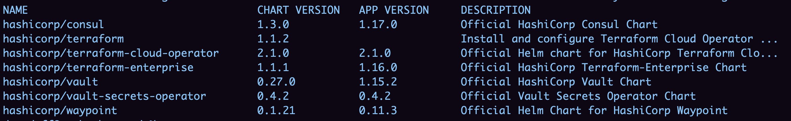

### 1. Подготовка сертификатов

Первое, что нужно сделать – это создать все необходимые сертификаты.
- Сертификаты CA, которыми в дальнейшем будут подписаны все остальные сертификаты, касающиеся Unseal-Vault
- Сертификаты самого vault'а, чтобы с ним возможно было устанавливать защищенное соединение.
- Клиентские сертификаты
	- Для всех vault'ов, которые будут автоматически распечатываться этим
	- Для vault operator'а, который будет использоваться внутри контейнера Unseal-Vault для управления им.

:::tip Сделать это можно двум способами:
1. Вручную (не рекомендуется)
	- [Создание CA сертификатов](/docs/TLS/CA-certs)
	- [Создание самоподписанных сертификатов](/docs/TLS/self-signed-certs)
2. С помощью Cert-Manager'а 
	- [Установка и использование Cert-Manager в K8S](/docs/Kubernetes/Installations/k8s-install-and-use-certmanager) (нам нужен вариант с собственным CA)
:::
### 2. Добавление репозитория в Helm

```sh
helm repo add hashicorp https://helm.releases.hashicorp.com
```

:::warning
Если вы из России, то работать эта ссылка без VPN у вас не будет.
Поэтому либо ставьте VPN, либо настраивайте свой прокси сервер, как я показываю в этой статье [Обход блокировки HashiCorp в helm](../helm-ru-block-evasion).

:::note Если ничего из вышеперечисленного делать пока не хочется – вы можете использовать мой прокси  http://hashicorp.proxy.davy.page
:::

После добавления репозитория по команде `helm search repo hashicorp` вам будет доступен список всех чартов HashiCorp.

:::tip Пример



### 3. Создание namespace

Для unseal-vault нужно создать отдельный namespace, в котором будет жить только он.

```sh
kubectl create ns unseal-vault
```

### 4. Helm конфигурация для установки

Создаём файл `helm-vault-values.yml`, хранящий в себе всю конфигурацию ресурсов vault, которые будут установлены в наш кластер. 

:::tip 
Подробнее про конфигурацию helm для установки vault можно почитать тут
https://developer.hashicorp.com/vault/docs/platform/k8s/helm/configuration
:::
```yaml
global:
  enabled: true
  tlsDisable: false
ui:
  enabled: false
injector:
  enabled: false
server:
  extraEnvironmentVars:
    VAULT_CACERT: /vault/tls/ca.crt
    VAULT_CLIENT_CERT: /vault/operator-tls/tls.crt
    VAULT_CLIENT_KEY: /vault/operator-tls/tls.key
  volumes:
    # Укажите секреты в которых хранятся ваши сертификаты
    - name: vault-tls
      secret:
        defaultMode: 420
        secretName: vault-tls
    - name: operator-tls
      secret:
        defaultMode: 420
        secretName: vault-client-operator-tls
  volumeMounts:
    - mountPath: /vault/tls
      name: vault-tls
      readOnly: true
    - mountPath: /vault/operator-tls
      name: operator-tls
      readOnly: true
  standalone:
    enabled: true
    config: |
      disable_mlock = true
      ui = false

      listener "tcp" {
        address = "[::]:8200"
        cluster_address = "[::]:8201"
        tls_cert_file = "/vault/tls/tls.crt"
        tls_key_file = "/vault/tls/tls.key"
        tls_client_ca_file = "/vault/tls/ca.crt"
        tls_require_and_verify_client_cert = "true"
      }

      storage "file" {
        path = "/vault/data"
      }
```
### 5. Установка Unseal-Vault на основе helm конфигурации

Конфигурацию из предыдущего шага вы можете установить, как есть командой `helm install`, но я этого делать не рекомендую, потому что, **как мне кажется**, устанавливая через `helm install` вы теряете необходимую гибкость управления вашим Vault кластером. Вы не сможете просто обновлять k8s ресурсы командами `kubectl edit` или `kubectl apply -f`, вместо этого вам придется обновлять все через values вашего helm релиза. В случае с Vault это не очень удобно.

Поэтому лучше сначала создать template того, что будет установлено.
:::warning Обязательно указываем через `-n` namespace, для установки в который будет создан template.
:::
```sh
helm template vault hashicorp/vault --values helm-vault-values.yml -n unseal-vault -o vault-install.yml
```

:::warning Для пользователей из РФ
У вас также не будет работать создание template'а по прямому указанию чарта из установленного ранее репозитория.

Для того чтобы всё заработало вам нужно либо использовать VPN, либо указать ссылку на нужный вам чарт из вашего прокси. 

Пример:
```
 helm template vault http://hashicorp.proxy.davy.page/vault-0.27.0.tgz --values helm-vault-values.yml -n vault -o vault-install.yml
```
:::

После этого в полученном файле удалить всё ненужное:
- Лейблы `app.kubernetes.io/managed-by` и `helm.sh/chart`
- Под `vault-server-test`

И настроить селектор у `volumeClaimTemplates` на использование нужного вам PV.

:::danger
Перед установкой создайте PV, который будет использовать ваш vault.

Так как vault будет запущен не под рутом (это настраивается в `securityContext`), у него может не быть доступа до директории, которую вы укажите в `hostPath` у PV. Поэтому не забудьте правильно настроить у этой директории доступ на запись и чтение (гуглить команды линукс `chmod` и `chown`).
 
```yml
apiVersion: v1
kind: PersistentVolume
metadata:
  name: vault-unseal-pv
  labels:
    volume-for: Unseal-Vault
spec:
  accessModes:
    - ReadWriteOnce
  capacity:
    storage: 10Gi
  hostPath:
    path: "/etc/kubernetes-volumes/vault-unseal-vol"
```
:::

Теперь вы можете установить vault использую привычный `kubectl`.

```sh
kubectl apply -f vault-install.yml
```
### 6. Инициализация

С помощью vault operator'а можно инициализировать vault, задав кол-во ключей, на которые алгоритмом Шамира разобьётся ключ шифрования данных vault'a. Эти ключи будут использоваться для ручного распечатывания.

```sh
kubectl exec -it vault-0 -- vault operator init \  
-key-shares=4 \  # кол-во ключей шамира
-key-threshold=2 \  # необходимок кол-во ключей для распечатывания
-format=json > vault-unseal-keys.json # файл, в который будут сохранены ключи
```

:::tip Полученный файл с ключами будет выглядеть примерно вот так:

```json
{  
  "unseal_keys_b64": [  
    "4Wm5BYsNal+zMbsb3ewNbi6zLtKIOXz3L+NFX7jw0/3T",  
    "miasg31FmPJqx9LrnPaVEuG639fvjAqZF3gp4ZlKw+wK",  
    "EyVw9nQH/T+3zsa4HbPJ2s15l6B5MizMKQlKqs9taFzX",  
    "zc7eU9MEvy9AaV4FPSQe7Jla2LcqSjS8KNPFDlQs0Rcg"  
  ],
  "unseal_keys_hex": [  
    "e169b9058b0d6a5fb331...",  
    "9a26ac837d4598f26ac7...",  
    "132570f67407fd3fb7cec...",  
    "cdcede53d304bf2f4069..."  
  ],
  "unseal_shares": 4,  
  "unseal_threshold": 2,  
  "recovery_keys_b64": [],  
  "recovery_keys_hex": [],  
  "recovery_keys_shares": 0,  
  "recovery_keys_threshold": 0,  
  "root_token": "hvs.NbXRWfYNI4PmA860aBlC4onU"
}	
```
:::
### 7. Создание транзитного ключа

Транзитный ключ будет использоваться для шифрования ключей vault'ов, которые будут распечатываться с Unseal-Vault'а. 

:::tip Все последующие операции будут проводиться внутри контейнера. Чтобы туда попасть введите `kubectl exec -it vault-0 -- /bin/sh`
:::
#### 7.1 Распечатайте vault

```sh
vault operator unseal
```
#### 7.2 Авторизуйтесь, используя `root_token`

```sh
vault login
```
#### 7.3 Создайте transit secret

```sh
vault secrets enable transit  
vault write -f transit/keys/autounseal
```

#### 7.4 Создайте policy для будущего токена

```sh
vault policy write autounseal -<<EOF
path "transit/encrypt/autounseal" {
  capabilities = [ "update" ]
}

path "transit/decrypt/autounseal" {
  capabilities = [ "update" ]
}
EOF
```

#### 7.5 Создайте Auto-unseal token

```sh
vault token create -orphan -policy=autounseal -period=24h  
```

:::tip Полученный токен будет выглядеть вот так:

```
Key                 Value  
token               hvs.CAESIP_A7TaC9kt4yUeqg... 
token_accessor      wkTM4nsF0ehkRvIuBD9cedHC  
token_duration      24h  
token_renewable     true  
token_policies      ["autounseal" "default"]  
identity_policies   []  
policies            ["autounseal" "default"]
```
:::

:::warning Вы должны сохранить значение `token`
Именно его вы будете указывать в настройке автоматического распечатывания в вашем vault.
:::

