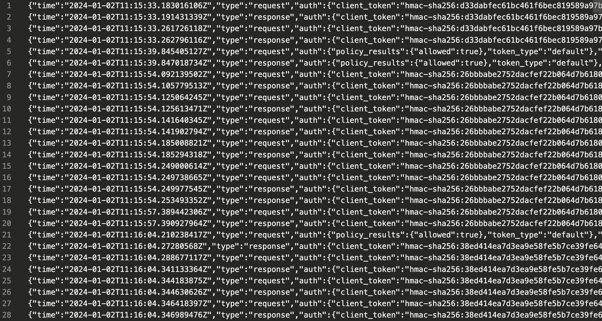

Для HashiCorp Vault, развернутого в продовом окружении, будет полезно (точно будет полезно) иметь возможность отслеживать, когда какие access-токены были использованы, что с их помощью пытались запросить, и какой ответ получили. 

По дефолту у HCV выключена функция ведения логов (вероятно для экономия памяти на диске), так что включается она только после запуска HCV кластера и сразу на всех узлах. 

### Как включить логирование?

Для каждого узла создайте файл, в котором будут храниться логи. Потом на одном из узлов кластера введите следующую команд:
```sh
vault audit enable file file_path=<Путь до созданного вами файла>
```

### Как читать логи?

Для этого достаточно зайти в файл, который вы указали в пункте выше. В нём по-строчно в формате json будут выведены все обращения к API этого узла HCV.

**Однако**, все token'ы в нём будут захешированы. В принципе расхешировать их никак нельзя, этож хеш)) Единственное, что можно сделать, это прогнать интересующию вас информацию через ту же хеш функцию и попробовать найти её в файле с логами. Например, вы можете захешировать token_accessor интересующего вас токена. Сделать это можно следующим образом:
```sh
vault write sys/audit-hash/file input="<TOKEN ACCESSOR>"

Key     Value
---     -----
hash    hmac-sha256:26bbbabe2752dacfef22b064d7b6180dc80a018e0d898bd72427678f6324d5c1
``` 


