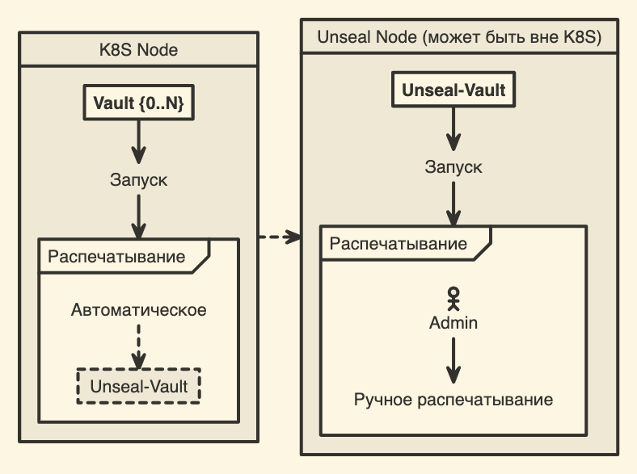

:::danger Необходимые компоненты:
- Cert-Manager для создания и управления сертификатами.
	- [Установка и использование Cert-Manager в K8S](../Kubernetes/k8s-install-and-use-certmanager)
- Ingress-Nginx для управления попадающим в кластер трафиком.
	- https://kubernetes.github.io/ingress-nginx/deploy
:::

:::danger Внимание
В нашем случае мы будем устанавливать vault с настройкой **auto-unseal**, для того, чтобы не приходилось распечатывать vault вручную каждый раз после перезапуска пода. **Auto-unseal будет производиться за счет отдельного vault'а, находящегося на другой машине.**
 

___
## Туториалы как настроить распечатывающий vault:
- Для docker (для машин с очень маленькими ресурсами) – [(Docker) Установка распечатывающего (unseal) Vault](./docker-istall-unseal-vault)
- Для k8s (стандартное решение) – [(K8S) Установка распечатывающего (unseal) Vault](./ks8-istall-unseal-vault)
:::

:::warning Vault будет использовать встроенное файловое хранилище, которое будет находиться на одной из нод кластера K8S.
:::
___
### 1. Подготовка сертификатов

Первое, что нужно сделать – это создать все необходимые сертификаты.
- Сертификаты самого vault'а, чтобы с ним возможно было устанавливать защищенное соединение.

:::warning
Сертификаты CA, а также все необходимые сертификаты для взаимодействия с распечатывающим vault'ом были подготовлены на этапе его создания.

Всё описано в туториалах выше.
:::

:::tip Сделать это можно двум способами:
1. Вручную (не рекомендуется)
	- [Создание самоподписанных сертификатов](../TLS/self-signed-certs)
2. С помощью Cert-Manager'а 
	- [Установка и использование Cert-Manager в K8S](../Kubernetes/k8s-install-and-use-certmanager) (нам нужен вариант с собственным CA)
:::

:::danger Обязательно указывайте доменные имена, по которым поды будут доступны

Пример:
```yml
dnsNames:
	- vault.vault
	- vault-0.vault-internal # для HA
	- vault-1.vault-internal # для HA
```
:::

### 2. Добавление репозитория в Helm

```sh
helm repo add hashicorp https://helm.releases.hashicorp.com
```

:::warning 
Если вы из России, то работать эта ссылка без VPN у вас не будет.
Поэтому либо ставьте VPN, либо настраивайте свой прокси сервер, как я показываю в этой статье [[🦀 Обход блокировки HashiCorp в helm]].

:::note 
Если ничего из вышеперечисленного делать пока не хочется – вы можете использовать мой прокси  http://hashicorp.proxy.davy.page
:::

После добавления репозитория по команде `helm search repo hashicorp` вам будет доступен список всех чартов HashiCorp.

:::tip Пример


:::
### 3. Создание namespace

Для vault нужно создать отдельный namespace, в котором будет жить только он.

```sh
kubectl create ns vault
```
### 4. Helm конфигурация для установки

Создаём файл `helm-vault-values.yml`, хранящий в себе всю конфигурацию ресурсов vault, которые будут установлены в наш кластер. 

:::tip
Подробнее про конфигурацию helm для установки vault можно почитать тут
https://developer.hashicorp.com/vault/docs/platform/k8s/helm/configuration
:::

```yml
global:
  enabled: true
  tlsDisable: false
ui:
  enabled: true
injector:
  enabled: false
server:
  extraEnvironmentVars:
    VAULT_CACERT: /vault/tls/ca.crt
  volumes:
    - name: vault-tls
      secret:
        defaultMode: 420
        secretName: vault-tls
    - name: unseal-vault-tls
      secret:
        defaultMode: 420
        secretName: vault-client-unseal-tls
  volumeMounts:
    - mountPath: /vault/tls
      name: vault-tls
      readOnly: true
    - mountPath: /vault/unseal-tls
      name: unseal-vault-tls
      readOnly: true
  standalone:
    enabled: true
    config: |
      disable_mlock = true
      ui = true
      listener "tcp" {
        tls_disable = "false"
        address = "[::]:8200"
        cluster_address = "[::]:8201"
        tls_cert_file = "/vault/tls/tls.crt"
        tls_key_file = "/vault/tls/tls.key"
      }

      storage "file" {
        path = "/vault/data"
      }

      seal "transit" {
        address = "https://UNSEAL-VAULT-HOST"
        token = "TOKEN"
        disable_renewal = "false"
        key_name = "autounseal"
        mount_path = "transit/"
        
        tls_ca_cert = "/vault/unseal-tls/ca.crt"
        tls_client_cert = "/vault/unseal-tls/tls.crt"
        tls_client_key = "/vault/unseal-tls/tls.key"
        tls_skip_verify = "false"
      }
```

:::tip
В нашей кнфигурации не настроен режим HA, это значит, что будет поднят **только один** под vault сервера. Если вам необходимо поднять несколько подов Vault для обеспечения отказоустойчивости, то в конфигурации для `server` замените `standalone` на следующий блок:
```
ha:  
  enabled: true  
  replicas: 2  // необходимое кол-во реплик
  raft:  
    enabled: true
  config: |
    disable_mlock = true
    ui = true 
    listener "tcp" {
      tls_disable = "false"
      address = "[::]:8200"
      cluster_address = "[::]:8201"
      tls_cert_file = "/vault/tls/tls.crt"
      tls_key_file = "/vault/tls/tls.key"
    }
    
    storage "raft" {
      path = "/vault/data"
      
      # Автоматическое присоединение к кластеру Vault.
      # Укажите тут все ваши поды кластера, для того чтобы при 
      # запуске пода, его сервер мог присоединиться к кластеру через 
      # лидирующий узел.
      retry_join {
        leader_api_addr = "https://vault-0.vault-internal:8200"
        leader_ca_cert_file = "/vault/tls/ca.crt"
        
        # В нашем случае у всех подов будет один и тот же сертификат.
        # Но по хорошему для каждого создавать отдельный.
        leader_client_cert_file = "/vault/tls/tls.crt"
        leader_client_key_file = "/vault/tls/tls.key"
      }
      
      retry_join {
        leader_api_addr = "https://vault-1.vault-internal:8200"
        leader_ca_cert_file = "/vault/tls/ca.crt"
        leader_client_cert_file = "/vault/tls/tls.crt"
        leader_client_key_file = "/vault/tls/tls.key"
      }
    }
    
    service_registration "kubernetes" {}
  
    seal "transit" {
      address = "https://UNSEAL-VAULT-HOST"
      token = "TOKEN"
      disable_renewal = "false"
      key_name = "autounseal"
      mount_path = "transit/"
      
      tls_ca_cert = "/vault/unseal-tls/ca.crt"
      tls_client_cert = "/vault/unseal-tls/tls.crt"
      tls_client_key = "/vault/unseal-tls/tls.key"
      tls_skip_verify = "false"
    }
```
:::

:::info
В нашей конфигурации `seal "transit"` отвечает за настройку автоматического распечатывания.
:::
### 5. Установка Unseal-Vault на основе helm конфигурации

Конфигурацию из предыдущего шага вы можете установить как есть командой `helm install`, но я этого делать не рекомендую, потому что в таком случае контроль над ресурсами перейдёт helm'у и управлять ими станет сложнее.

Лучше сначала создать template того, что будет установлено.

:::warning Обязательно указываем через `-n` namespace, для установки в который будет создан template.
:::

```sh
helm template vault hashicorp/vault --values helm-vault-values.yml -n vault -o vault-install.yml
```

:::warning Для пользователей из РФ
У вас также не будет работать создание template'а по прямому указанию чарта из установленного ранее репозитория.

Для того чтобы всё заработало вам нужно либо использовать VPN, либо указать ссылку на нужный вам чарт из вашего прокси. 

Пример:
```
 helm template vault http://hashicorp.proxy.davy.page/vault-0.27.0.tgz --values helm-vault-values.yml -n vault -o vault-install.yml
```
:::

После этого в полученном файле удалить всё ненужное:
- Лейблы `app.kubernetes.io/managed-by` и `helm.sh/chart`
- Под `vault-server-test`

И настроить селектор у `volumeClaimTemplates` на использование нужного вам PV, используя селекторы.

::::danger Перед установкой создайте PV, который будет использовать ваш vault.
 
Так как vault будет запущен не под рутом (это настраивается в `securityContext`), у него может не быть доступа до директории, которую вы укажите в `hostPath` у PV. Поэтому не забудьте правильно настроить у этой директории доступ на запись и чтение (гуглить команды линукс `chmod` и `chown`).

:::warning 
Если вы в прошлом шаге использовали настройку для HA режима, то вам придётся создать такие PV для каждого пода vault.
:::
Пример:
```yml
apiVersion: v1
kind: PersistentVolume
metadata:
	name: vault-unseal-pv
	labels:
		volume-for: vault
spec:
	accessModes:
		- ReadWriteOnce
	capacity:
		storage: 10Gi
	hostPath:
		path: "/etc/kubernetes-volumes/vault-vol-0"
```
::::

Теперь вы можете установить vault использую привычный `kubectl`.

```sh
kubectl apply -f vault-install.yml
```
### 6. Инициализация

С помощью vault operator'а можно инициализировать vault. 

Полученные после инициализации будут использоваться для миграции vault'а. Например на другой распечатывающий сервер.

```sh
kubectl exec -it vault-0 -- vault operator init > vault-recovery-keys.json
```

:::warning
Если у вас настроен HA режим, то init'ить вам необходимо только один под – все остальные создадутся от него. Если это не происходит автоматически, то перезапустите их.
:::