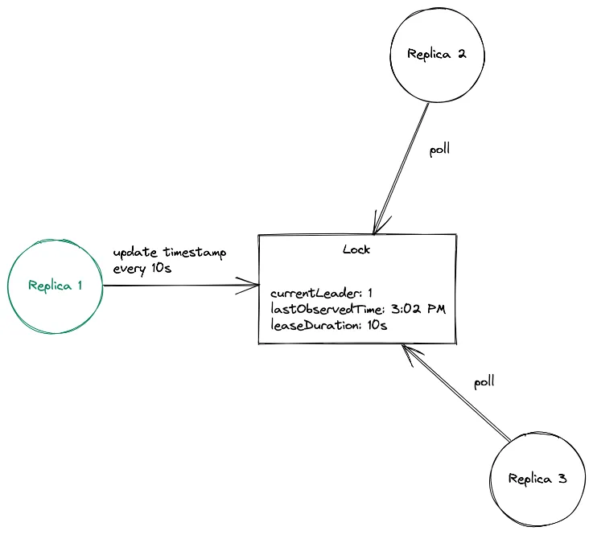
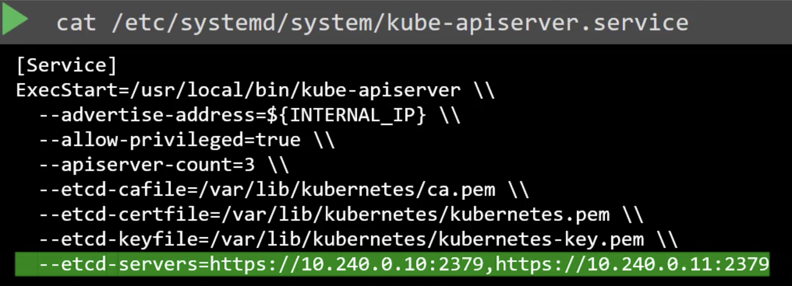

HA режим – это конфигурация кластера kubernetes с двумя и более Master Node'ами и соответственно с двумя и более Control Plane'ами для обеспечения лучшей отказоустойчивости кластера.

### Как это работает?
Мастер ноды делятся на две части: **активная нода** и **standby ноды**.

Процесс выбора активной ноды в Kubernetes довольно прост. Он начинается с создания lock object, в котором активная нода периодически обновляет текущий timestamp, чтобы информировать standby ноды о том, что она активна. Этот lock object, который может быть либо `Lease`, либо `ConfigMap`, либо `Endpoint`, также содержит идентификатор текущей активной ноды. Если активная нода не обновляет timestamp в предусмотренный интервал, предполагается, что она вышла из строя, и запускается election process. Standby ноды будут пытаться обновить lock object своим идентификатором. Нода, которой успешно удастся захватить блокировку, станет новой активной нодой.

### Как работаю компоненты Control Plane?
1. **kube-apiserver**
	- Работает параллельно на всех мастер нодах. Желательно иметь балансировщик нагрузки для них на отдельном узле.
2. **kube-scheduler**
	- Работает только на активной мастер ноде.
3. **kube-controller-manager** 
	- Работает только на активной мастер ноде.
4. **ETCD** 
	- Работает распределённо и может быть установлен на каждой мастер ноде.

:::info tip
Лучше выводить кластер ETCD из Control Plane на отдельные сервера, если у вас есть ресурсы на это. **Помните, что в конфигурации kube-apiserver'ов нужно указывать все инстансы ETCD кластера.**

:::

___

### Как работает кластер ETCD в HA режиме? (тезисно)

- Модель: лидер и фоловеры
- Читать можно со всех узлов
- Писать можно тоже во все узлы, но сама запись будет производиться лидером. Если вы попытаетесь записать данные в фоловера, он сам передаст их лидеру на запись.
- Запись данных считается завершённой только тогда, когда мастер удостоверится, что данные были записаны на "большинство" узлов.
:::info Что значит "большинство"?
Количество узлов определяемых за "большинство" получается по формуле `(всего / 2) + 1`. 
- Для кластера из 1 инстанса: 1
- Для кластера из 2 узлов: 2
- Для кластера из 3 узлов: 2
- Для кластера из 4 узлов: 3
- Для кластера из 5 узлов: 3
- Для кластера из 6 узлов: 4
- Для кластера из 7 узлов: 4 
- и тд
:::
- Если у вас в кластере упадут слишком много нод и "большинство" не будет сформировано, то **весь** кластер потухнет.
- Если лидер становится недоступен, то фоловеры запускают у себя таймер, и когда он заканчивается, они отсылают всем остальным фоловерам запрос на то, что бы они стали лидерами. По итогу, лидером становится тот, у кого первого закончится таймер, и кто получит одобрения от всех остальных фоловеров.
