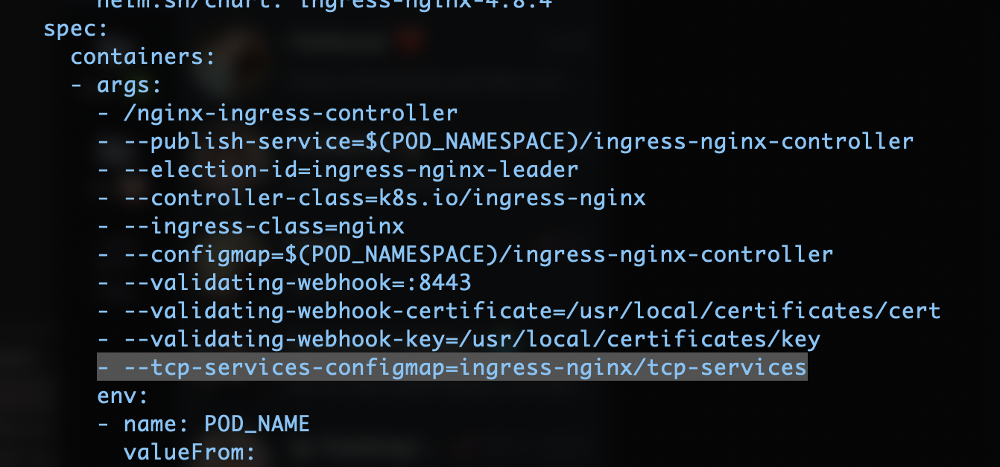
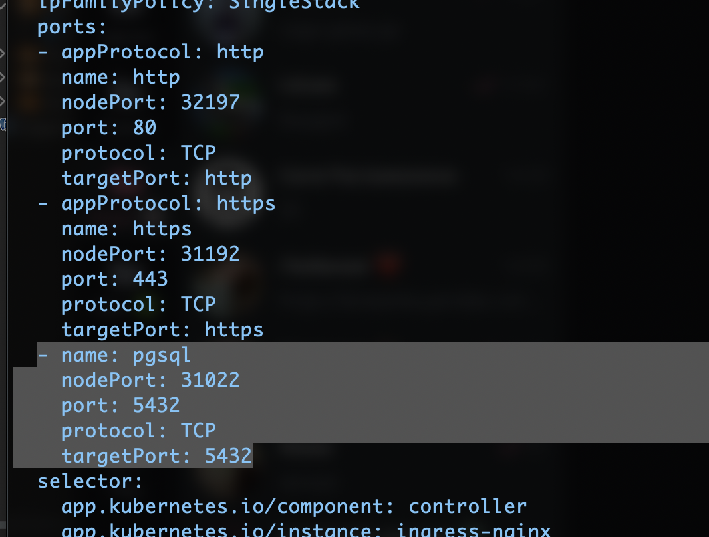

Если вам понадобится выводить сервисы на конкретные порты из кластера, а не на домен или path домена (**например вывести порт для postgresql**), то вам нужно будет выполнить следующие действия.

### В случае если ingress-nginx был установлен через Helm

```sh
# helm upgrade release-name repo/chart -f helm-values-file -n namespace
helm upgrade ingress-nginx ingress-nginx/ingress-nginx -n ingress-nginx -f helm-values.yml 
```

```yml title="helm-values.yml"
controller:
  containerPort:
    http: 80
    https: 443

    # обязательно ключ указывайте в формате "<port>-tcp" (или "<port>-udp" если выводите udp порт)
    "5432-tcp": 5432 # ваш порт
  service:
    ports:
      http: 80
      https: 443
      pgsql: 5432 # ваш порт
    targetPorts:
      http: http
      https: https
      pgsql: pgsql # ваш порт
tcp: 
  5432: "sobes/db-service:5432" # <namespace>/<service-name>:<service-port>
```

### В случае если ingress-nginx был установлен через kubectl

1. Создать ConfigMap для ingress-nginx описывающий порты и tcp сервисы, которые будут открываться.
**Пример конфига `tcp-services`** 
```yaml
apiVersion: v1
kind: ConfigMap
metadata:
  name: tcp-services
  namespace: ingress-nginx # обязательно создаём в том же неймспейсе
              						 # в котором создан и сам контроллер  
data:
  5432: "sobes/db-service:5432"
       # <namespace>/<service-name>:<service-port>
```
2. Указать имя созданного конфига в deployment файле `ingress-nginx-controller`.
	Формат `<namespace>/<configmap-name>` 
3. Указать порты LoadBalancer сервису `ingress-nginx-controller` 
	